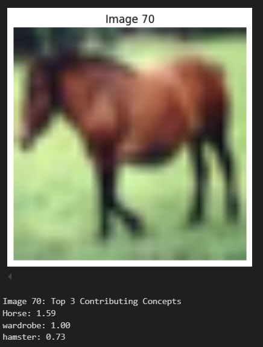

# Sparsity in Contrastive Models

This repository explores the use of sparse signal recovery methods, such as l1-relaxation, to improve the interpretability of multimodal representations in contrastive models like CLIP (Contrastive Language–Image Pretraining). The primary objective is to evaluate how sparse CLIP embeddings compare to dense embeddings in a zero-shot classification task.

## Features

1. **Zero-Shot Classification with Dense Embeddings**
   - Use a pre-trained CLIP model to generate dense image and text embeddings.
   - Perform zero-shot classification by computing cosine similarity between embeddings.

2. **Inducing Sparsity in CLIP Embeddings**
   - Build a concept dictionary from human-readable tokens using CLIP's text encoder.
   - Enforce sparsity through l1-regularized optimization.
   - Align image and concept embeddings to a shared latent space.

3. **Sparse vs Dense Embeddings**
   - Compare classification accuracy, memory footprint, and computational advantages.
   - Analyze the relationship between sparsity level and accuracy.
   - Identify top contributing concepts and provide qualitative examples.

## Usage

### Installation
Clone the repository and install the required dependencies:
```bash
git clone https://github.com/your-username/sparsity-contrastive-models.git
cd sparsity-contrastive-models
pip install -r requirements.txt
```

### Data Preparation
We use the CIFAR-10 dataset for the experiments. The dataset will be automatically downloaded when running the scripts.

### Running the Project
1. **Generate Dense Embeddings**
   - Use the pre-trained CLIP model to extract dense image embeddings and text embeddings.

2. **Build Concept Dictionary**
   - Create a concept dictionary from CIFAR-10 classes or a larger vocabulary set.
   - Use CLIP's text encoder to embed concepts into a shared latent space.

3. **Sparse Embedding Generation**
   - Solve the optimization problem:
     
   - Reconstruct sparse embeddings using the concept dictionary.

4. **Zero-Shot Classification**
   - Compute cosine similarity between embeddings for classification.
   - Compare results for dense and sparse embeddings.

5. **Evaluation**
   - Report accuracy, sparsity levels, memory footprint, and qualitative insights.

## Results

### Zero-Shot Classification with Dense and Sparse Embeddings
- **Dense Embeddings**: Achieved a **test accuracy of 0.95**, demonstrating that CLIP can successfully classify CIFAR-10 images using dense representations.
- **Sparse Embeddings**: Achieved a **test accuracy of 0.88**, which is slightly lower than the dense embeddings but still shows that sparse embeddings retain enough key features to perform reasonably well for classification.

### Sparsity-Accuracy Tradeoff
- **Optimal Sparsity vs Accuracy**: We observed an interesting relationship between the level of sparsity and classification accuracy. Initially, reducing sparsity improved the accuracy, but after reaching a threshold (around λ = 2 to λ = 0.5), further sparsification did not lead to significant accuracy gains.
- **Graph Analysis**: The relationship between sparsity and accuracy was plotted, showing that an optimal sparsity level exists, where the embeddings are both compact and informative enough for classification. 

  <!-- Replace with actual path for image file -->

### Memory Efficiency of Sparse Embeddings
- **Memory Comparison**: Sparse embeddings were significantly more memory-efficient, using only **3.87%** of the memory required by dense embeddings. Specifically, sparse embeddings consumed only **3972 bytes** compared to **102400 bytes** for dense embeddings. This demonstrates a substantial memory saving with only a marginal loss in accuracy.

### Concept Analysis in Sparse Embeddings
- During the classification, we analyzed the active concepts in the dictionary for each image. We found that the top contributing concepts aligned well with the true labels for most images, with some mispredictions being marginal (e.g., the class "Airplane" being incorrectly predicted as "Fox").
- Examples of active concepts in misclassified and correctly classified images are shown below.

  <!-- Replace with actual path for image file -->
  <!-- Replace with actual path for image file -->

### Evaluation Summary
- **Accuracy**: Sparse embeddings achieved an accuracy of 0.88, while dense embeddings achieved 0.95.
- **Sparsity-Accuracy Tradeoff**: There exists an optimal sparsity threshold for achieving high classification accuracy.
- **Memory Efficiency**: Sparse embeddings offered a **96.13% memory reduction** compared to dense embeddings.

## Dependencies
- Python 3.10+
- PyTorch
- torchvision
- transformers (Hugging Face)
- timm
- matplotlib

## Example Code

### Loading Libraries and Dataset
```python
from models.model import CLIPModel
from models.utils import train_step, eval_step, DataLoaders
from torchvision.datasets import CIFAR10
from transformers import DistilBertTokenizer
import torchvision.transforms as transforms

transform = transforms.Compose([transforms.ToTensor()])
train = CIFAR10(root='data', train=True, download=True, transform=transform)
test = CIFAR10(root='data', train=False, download=True, transform=transform)
```

### Building Concept Dictionary
```python
tokenizer = DistilBertTokenizer.from_pretrained('distilbert-base-uncased')
classes = ["Airplane", "Automobile", "Bird", "Cat", "Deer", "Dog", "Frog", "Horse", "Ship", "Truck"]
concept_dictionary = []

for caption in classes:
    encoded_captions = tokenizer(caption, padding=True, truncation=True, return_tensors='pt')
    text_emb = model.text_encoder(input_ids=encoded_captions['input_ids'], attention_mask=encoded_captions['attention_mask'])
    concept_dictionary.append(text_emb)
```

## Contributions
Contributions are welcome! Feel free to open issues or submit pull requests.

## License
This project is licensed under the MIT License. See the [LICENSE](LICENSE) file for details.

## Acknowledgments
- The CLIP model is provided by OpenAI.
- CIFAR-10 dataset is sourced from [https://www.cs.toronto.edu/~kriz/cifar.html](https://www.cs.toronto.edu/~kriz/cifar.html).
```
